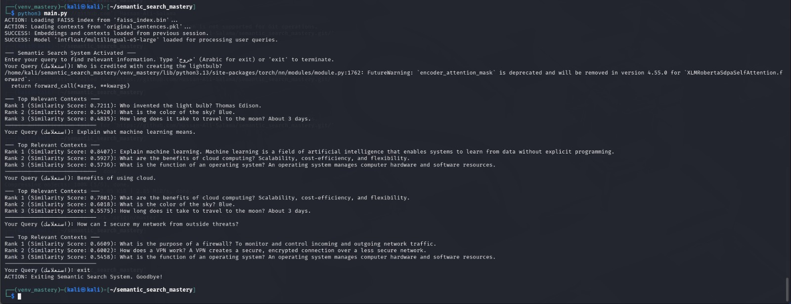

# Semantic Search System (Retrieval Component for RAGs)

## 🚀 Project Overview

This project demonstrates the implementation of a basic semantic search system using vector embeddings and FAISS. Its primary goal is to retrieve the most semantically relevant contexts based on a user's query, moving beyond traditional keyword-based search. This system forms the core "Retrieval" component of a comprehensive RAG (Retrieval-Augmented Generation) pipeline.

## ✨ Key Features

* **Semantic Understanding:** Capable of understanding the meaning of queries and texts, not just keyword matching.
* **Vector Embeddings:** Transforms textual data into high-dimensional numerical vectors using a powerful Sentence Transformer model.
* **FAISS Vector Database:** Efficiently stores and performs rapid similarity searches on millions of vectors.
* **Command-Line Interface (CLI):** Allows users to directly input queries and view relevant results.
* **Multilingual Support:** Utilizes a multilingual model (e.g., `intfloat/multilingual-e5-large`) to support both English and Arabic queries.

## 🛠️ Prerequisites

Ensure you have Python 3 and `pip` installed on your system.

## ⚙️ Setup and Running Instructions

Follow these steps to get the project up and running on your local machine:

1.  **Clone the Repository:**
    ```bash
    git clone [https://github.com/Hassan-Ali-Salama/semantic_search_mastery.git](https://github.com/Hassan-Ali-Salama/semantic_search_mastery.git)
    cd semantic_search_mastery
    ```

2.  **Create and Activate a Python Virtual Environment:**
    ```bash
    python3 -m venv venv_mastery
    source venv_mastery/bin/activate
    ```

3.  **Install Required Libraries:**
    ```bash
    pip install sentence-transformers faiss-cpu numpy
    ```

4.  **Prepare Your Knowledge Base:**
    Ensure you have a `knowledge_base.txt` (or `سياقات_البحث.txt`) file in the project's root directory. This file contains the contexts your system will search.
    (The default content is already provided in the repository).

5.  **Run the System:**
    ```bash
    python3 main.py
    ```
    **Important Note:** The first time you run this script, it will download the specified language model (which might take some time depending on its size and your internet speed) and then generate and save the embeddings. Subsequent runs will be much faster as it will load the pre-generated embeddings.

## 🚀 Usage Examples

After running `python3 main.py`, the system will prompt you to enter a query. Try the following examples:

### English Queries
* `Your Query: What is the main city of France?`
* `Your Query: How does a private network work?`
* `Your Query: Explain what machine learning means.`



### Arabic Queries
* `استعلامك: ما هي عاصمة فرنسا؟`
* `استعلامك: ما فائدة الجدار الناري؟`
* `استعلامك: عرف لي التعلم الآلي.`


To exit the program, type `خروج` (Arabic for exit) or `exit`.

## 📂 Project Structure
.
├── main.py                 # Main script for the semantic search system
├── knowledge_base.txt      # Text file containing the search contexts (your knowledge base)
├── .gitignore              # Specifies files and directories to be ignored by Git
├── README.md               # This documentation file
└── screenshots/            # Directory for project screenshots
├── english_query_example.png
└── arabic_query_example.png

Files below are generated automatically and are ignored by .gitignore
├── faiss_index.bin # FAISS index for storing embeddings
└── original_sentences.pkl # Pickle file storing original contexts

## 📚 Additional Resources

* [Sentence Transformers Documentation](https://www.sbert.net/)
* [FAISS GitHub Repository](https://github.com/facebookresearch/faiss)
* [Hugging Face Models (for finding other models)](https://huggingface.co/models)

## 📞 Contact

If you have any questions or feedback, feel free to reach out.

---
**Note for Evaluator:** This project successfully implements the core "Retrieval" component as defined in the RAGs (Retrieval-Augmented Generation) task goal.
